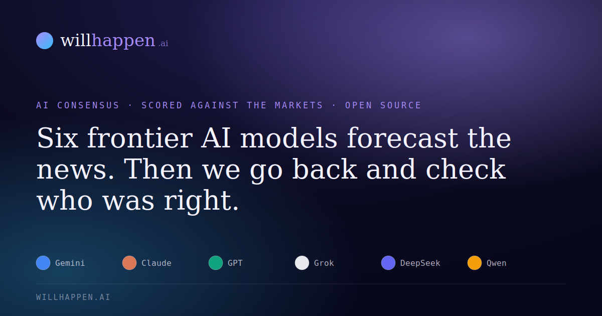

<p align="center">
  
</p>

<h1 align="center">WillHappen.ai</h1>

<p align="center">
  <b>Six frontier AI models forecast the news. Then the machine goes back and checks who was right.</b><br>
  <a href="https://willhappen.ai">willhappen.ai</a> ·
  <a href="https://willhappen.ai/models">live scoreboard</a> ·
  <a href="https://willhappen.ai/about">method</a>
</p>

<p align="center">
  
  
  
  
</p>

---

Everyone has an opinion about whether AI models are any good at predicting things.
Almost nobody keeps score.

This does. Every hour it reads live prediction markets and the news, turns what it finds
into dated, falsifiable statements, and asks six models from six different labs to put a
number on each one. When a deadline passes it searches for the outcome, cites its sources,
and records who was right — including the market, graded on exactly the same questions.

Nothing is curated after the fact. No forecast is edited, no miss is quietly deleted.

## What makes it different

**The models are benchmarked against money.** Most AI forecasting demos grade a model
against itself. Here every question that comes from Polymarket or Kalshi arrives with a
price real traders agreed on, and that price is scored alongside the models. The question
stops being "is the AI confident?" and becomes "is the AI better than the crowd?"

**No model is ever shown the market price.** If it were, the edge published on every page
would only measure how well a model can read a number out of its prompt.

**Outcomes resolve themselves, and say what they rest on.** Deciding whether something
happened is the one place a bug becomes a falsehood on a page, so it is tiered by how good
the evidence actually is. First the exchange: most questions come from Polymarket or Kalshi,
and those markets settle themselves with real money and a formal dispute window — when the
exchange has paid out, that is the answer, and no model gets a vote. Only questions with no
market behind them go to a jury of three models from three different labs, ruling
independently on identical cited evidence; unanimous or it does not publish. Every verdict
names which route it took.

**It is small enough to read in an evening.** One Worker, one KV namespace, one API key.
No framework, no bundler, no build step, no database.

## The loop

```
        ┌──────────────────────────── every hour ────────────────────────────┐
        │                                                                    │
   Polymarket ─┐                                                             │
   Kalshi ─────┼─► harvest ──► curate ──► queue ──► forecast ──► publish ──┐ │
   news sweep ─┘   (what's     (dated,              (6 models,    (page,   │ │
                    live now)   falsifiable)         independent)  card)   │ │
                                                                           │ │
        ┌──── scoreboard ◄──── verdict ◄──── judge ◄──── evidence ◄─────────┘ │
        │      (Brier,         (auto if     (rules on   (search +             │
        │       calibration)    confident)   evidence)   citations)           │
        └────────────────────────────────────────────── deadline passes ──────┘
```

Hourly rather than nightly for a practical reason: a Worker invocation gets roughly 50
subrequests, KV operations included, and 50 questions × 6 models does not fit in one.
Slicing the work also means pages publish steadily through the day instead of in one
3am dump.

## Self-host it in ten minutes

You need a Cloudflare account and an [OpenRouter](https://openrouter.ai) key. Nothing else.

```bash
git clone https://github.com/dmusato/willhappen.ai.git
cd willhappen.ai
npm install

npx wrangler kv namespace create WH_KV      # paste the id into wrangler.toml
npx wrangler secret put OPENROUTER_API_KEY
npx wrangler secret put ADMIN_TOKEN         # any long random string
npx wrangler deploy
```

Then fill the archive without waiting for the next cron tick:

```bash
curl -X POST https://your-worker.workers.dev/api/admin/run \
  -H "authorization: Bearer $ADMIN_TOKEN" \
  -d '{"plan":{"forecasts":4,"harvestMarkets":true}}'
```

### Run it locally without any key

```bash
echo "MOCK_LLM=1"          > .dev.vars
echo "ADMIN_TOKEN=localdev" >> .dev.vars
npm run dev
```

`MOCK_LLM=1` makes every model call return a deterministic synthetic answer, so the entire
loop — harvest, curate, forecast, resolve, score, post — runs offline. Market data is still
fetched live, because those APIs are free and need no key.

```bash
npm run markets   # what the exchanges would give you right now, no keys needed
npm test          # unit tests
npm run lint      # syntax + JSON check, no dependencies
```

## What it costs

A question put to all six models costs about **one cent**. At 30 questions a day, with the
hourly news sweep and the resolver, the whole thing runs at roughly **$18/month** —
and Cloudflare's free tier covers the hosting.

The Worker meters spend from the cost OpenRouter reports on every call and writes it to a
daily ledger in KV, so `DAILY_BUDGET_USD` is a hard stop rather than an estimate. When the
budget is reached it keeps doing the free work — re-pricing markets, recomputing the
scoreboard — and stops calling models until the next UTC day.

## Configuration

Everything lives in `wrangler.toml`. The defaults are tuned for the budget above.

| Variable | Default | What it does |
|---|---|---|
| `DAILY_QUESTIONS` | `30` | Forecasts per UTC day. `0` removes the cap. |
| `DAILY_BUDGET_USD` | `0.70` | Hard spend stop, measured against reported cost. |
| `FORECASTS_PER_RUN` | `2` | Questions put to the panel each hour. |
| `MARKET_SOURCES` | `polymarket,kalshi` | Which exchanges to harvest. |
| `MARKET_MIN_LIQUIDITY` | `5000` | Skip markets thinner than this. |
| `RESOLVE_MIN_CONFIDENCE` | `80` | Jury mean below this waits for a human. |
| `RESOLVE_MIN_SOURCES` | `2` | Minimum citations before a jury verdict publishes. |
| `RESOLVE_MARKET_WAIT_DAYS` | `21` | How long to let an exchange be slow to settle. |
| `RESOLVE_GIVE_UP_DAYS` | `120` | Retire an unresolvable question to review. |
| `LEADERBOARD_MIN_SAMPLE` | `10` | Outcomes needed before a row is ranked. |

### Secrets

| Secret | Required | For |
|---|---|---|
| `OPENROUTER_API_KEY` | yes | Every model call. |
| `ADMIN_TOKEN` | yes | `/api/admin/*`. Without it the whole admin surface 503s. |
| `GH_TOKEN` | no | `/suggest` opens GitHub issues. Scope: `public_repo`. |
| `POSTIZ_API_KEY` | no | Posts to every channel connected in [Postiz](https://postiz.com). |

Social posting is opt-in and channel-agnostic: connect X, Instagram, Reddit, Pinterest,
Telegram or any of Postiz's other platforms in its UI and the Worker discovers them. Direct
X / Reddit / Meta adapters are included for anyone who would rather not run an aggregator.

## Swapping the panel

The roster is data. Adding a lab is one line in [`src/ai/roster.js`](src/ai/roster.js):

```js
export const PANEL = [
  { key: "gemini",   name: "Gemini",   lab: "Google",    model: "google/gemini-3.8-flash",      color: "#4285f4", ink: "#fff" },
  { key: "claude",   name: "Claude",   lab: "Anthropic", model: "anthropic/claude-sonnet-5",    color: "#d97757", ink: "#fff" },
  { key: "gpt",      name: "GPT",      lab: "OpenAI",    model: "openai/gpt-5.6-terra",         color: "#10a37f", ink: "#fff" },
  { key: "grok",     name: "Grok",     lab: "xAI",       model: "x-ai/grok-4.6",                color: "#e8eaf0", ink: "#05061a" },
  { key: "deepseek", name: "DeepSeek", lab: "DeepSeek",  model: "deepseek/deepseek-v4.1-flash", color: "#6366f1", ink: "#fff" },
  { key: "qwen",     name: "Qwen",     lab: "Alibaba",   model: "qwen/qwen3.8-max-0902",        color: "#f59e0b", ink: "#05061a" },
];
```

Nothing else in the codebase hardcodes a model key — the UI, the share cards and the
scoreboard all read this list. Topics, horizons and news beats live in
[`src/catalog.js`](src/catalog.js).

## Layout

```
src/
  worker.js          routing, page rendering, the cron entry point
  catalog.js         topics, horizons, news beats
  util.js            slugs, fingerprints, concurrency pool
  ai/
    openrouter.js    the only place that talks to a model
    roster.js        the panel, and the search/reason jobs
  markets/           polymarket.js · kalshi.js — one shape per exchange
  pipeline/
    harvest.js       markets + news → dated falsifiable statements
    forecast.js      one question → six independent answers → a record
    resolve.js       exchange settlement, else a three-model jury on cited evidence
    refresh.js       re-price open markets so drift is visible
    score.js         Brier, skill, calibration, market benchmark
    run.js           what one hourly slice actually does
  render/            server-side HTML: shell.js · components.js · pages.js
  handlers/          /api/*, share cards, sitemap, RSS, admin
  social/            postiz.js + direct X / Reddit / Meta adapters
  store/kv.js        every KV read and write, in one file
public/              style.css, app.js, favicon, seed JSON
test/                unit tests (node --test, no framework)
```

## API

Read-only endpoints are public and CORS-open — build something on top of it.

| Endpoint | Returns |
|---|---|
| `GET /api/predictions` | Filtered, sorted index. `?topic=&horizon=&status=&sort=&q=&limit=&offset=` |
| `GET /api/predictions/{id}` | One full record: every model's number, note and timestamp. |
| `GET /api/leaderboard` | Brier, skill, accuracy and calibration bins per model. |
| `GET /api/catalog` | Topics, horizons and the model roster. |
| `GET /og/{id}.png` | The share card. Add `?v=square` for 1:1. |
| `GET /feed.xml` | RSS. |

Every record carries `verdict_method` — `exchange`, `jury` or `maintainer` — so anything
built on this can weight an outcome by how it was decided.

Sorts: `new`, `soon`, `far`, `contested`, `edge`, `confident`, `likely`, `unlikely`.

## Contributing

- **Something it should be watching?** [Suggest a question](https://willhappen.ai/suggest) — it becomes a public issue.
- **A verdict looks wrong?** [Dispute it](../../issues/new?template=report-outcome.yml) with a source. Auto-resolution is fallible and disputes are the point of publishing the sources.
- **Code?** PRs welcome. `npm run lint && npm test` before pushing. Keep it vanilla — if a new dependency feels necessary, try twenty lines of plain JS first.

## Limits, stated plainly

- Language models are not oracles. They are fluent, confident, and wrong on a schedule nobody has mapped. That is the reason to keep score in public rather than an argument against it.
- Question selection is biased toward what prediction markets and English-language news cover.
- Auto-resolution can be wrong. Confident verdicts still publish themselves, with sources attached, and disputes are welcome.
- Brier scores over a few dozen questions are noisy. The scoreboard says so until there is enough history.
- None of this is financial advice.

## License

MIT — see [LICENSE](LICENSE). Point it at your own topics and it becomes your archive.
